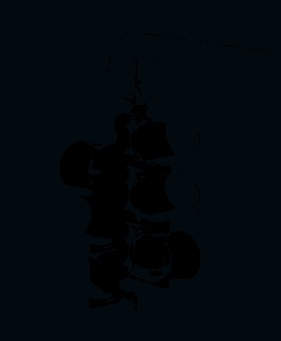

# K-Means-Clustering-in-Color-Filtering
A script to create 4 clusters that filter based on the K- Mean Algorithm

## Description

Here we are given an image to segement using the Kmeans alogrithm. The values that we are tracking in a image segmentation of KMean is the difference in BGR values from the clusters and each individual point. We do not use any in-built function except numpy to carry out basic operations
on Matricies. We start by assigning the start position for each cluster. We create a copy of the image and add a channel alongside BGR the fourth channel is encoded to classify the pixel into one of the four clusters. We calculate the difference between each pixels BGR values to the cluster’s val-
ues and calculate the difference and based on the lowest difference which cluster it is closest to is assigned cluster. This is what is used as the break condition for the while loop to exit updation of cluster centers this is done to avoid an infinite loop.

If the distance in the BGR channels is lower ie if a different cluster ’k’ is closer then that particular pixel is assigned to that channel. This updates the points and once the entire image have been passed through the average of all BGR values in a given cluster is calculated and assigned as the
new cluster center. This process occurs until there is no shift in the cluster centers between iterations.

## Folder Structure:
```
📦K-Means-Clusturing-in-Color-Filtering
 ┣ 📂Media
 ┃ ┗ 📂Q4
 ┃ ┃ ┗ 📜Q4image.png
 ┣ 📂Results
 ┃ ┗ 📂question_4
 ┃ ┃ ┣ 📜Kmean_1_cluster.jpg
 ┃ ┃ ┣ 📜Kmean_2_cluster.jpg
 ┃ ┃ ┣ 📜Kmean_3_cluster.jpg
 ┃ ┃ ┣ 📜Kmean_4_cluster.jpg
 ┃ ┃ ┗ 📜question_4_results.jpg
 ┣ 📜README.md
 ┗ 📜k_means_clustering.py
```

## Results

<table>
 <tr>
   <td><p align='center'> Original Image </p></td>
   <td><p align='center'> Cluster 1 </p></td>
 </tr>
 <tr>
   <td><p align='center'> Cluster 2 </p></td>
   <td><p align='center'> Cluster 3 </p></td>
 </tr>
 <tr>
   <td><p align='center'> Cluster 4 </p></td>
   <td><p align='center'> Results </p></td>
 </tr>
</table>
